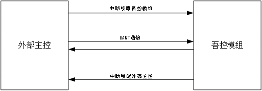

> # UWB-PDoA物联网关网络侧API
>

| 版本  |   日期   |          备注          |
| :---: | :------: | :--------------------: |
| 1.0.0 | 20240805 |   PDoA网关网络侧API    |
| 1.0.1 | 20240829 | 新增蓝牙连接、断开指令 |

## 概述

网络侧默认使用UDP传输（串口转UDP）推向本地边缘计算中心进行核心调度（称为定位核心网）。

> 1.若PDoA作为模块存在，根据当前实现的硬件架构，虽然外部主控和模组独立工作，但存在双方数据交互，这些信息的交互主要由通过UART媒介进行（在UART交互前进行IO唤醒）
>
> 2.通信方式：UART；通信速率：115200；数据位：8；停止位：1；奇偶校验：无；数据流控：无
>
> 
>
> 3.外部主控指MTK7688等网络模块，具备将串口数据转为网络数据；
>
> 4.吾控模组指支持标准Fira的模组；

## 协议帧格式说明

|   字节0    |     字节1     |     字节2     | 字节3~字节n |
| :--------: | :-----------: | :-----------: | :---------: |
| 数据包类型 | 有效载荷长度1 | 有效载荷长度2 |  有效载荷   |

**（字节0）数据包类型**：

00：通知消息；

01：吾控模组UCI消息；

02：终端手环UCI消息；

03：状态信息获取消息；

f0：心跳包消息；

f1：UWB固件升级文件；（暂不支持）

ff：控制指令消息。

**（字节1）有效载荷长度1、（字节2）有效载荷长度2**：按照大端模式组合长度，表示字节3到字节n的总长度。

**（字节3~字节n）有效载荷：**标准UCI消息。

> 发送：ff 00 01 01 （数据包类型为控制指令消息，有效载荷长度为1个字节，有效载荷为01）
>
> 回复：00 00 02 ff 00 （数据包类型为通知消息，有效载荷长度为2个字节，有效载荷为ff 00）
>
> 发送：01 00 09 21 00 00 05 0F A6 44 BE 00（数据包类型为吾控模组UCI消息，有效载荷长度为9个字节，有效载荷参阅Fira标准协议文档）
>
> ......
>

## 通知消息

通知消息是外部主控对模组发起通信的回复，有效载荷长度根据实际情况处理。

| 有效载荷1 |     有效载荷2      |      有效载荷3~有效载荷n       |    发起方向    |      备注      |
| :-------: | :----------------: | :----------------------------: | :------------: | :------------: |
|   0xff    | 0x01：控制消息类型 | 0x00：设置成功，0x01：设置失败 | 模组->外部主控 |  设置成功与否  |
|   0x01    |        预留        |   0x01：未找到相关数据包类型   | 模组->外部主控 | 数据包正确与否 |
| 0x04-0xfe |        预留        |              预留              | 模组->外部主控 |      预留      |

## 状态信息获取消息

状态信息获取消息是外部主控对模组发起通信，有效载荷长度根据实际情况处理。

| 有效载荷1 | 有效载荷2~有效载荷n |    发起方向    |        备注         |
| :-------: | :-----------------: | :------------: | :-----------------: |
|   0x01    |         空          | 外部主控->模组 |   获取主板MAC地址   |
|   0x02    |         空          | 外部主控->模组 | 获取主板UCI通信状态 |
|   0x03    |         空          | 外部主控->模组 | 获取主板UWB电源状态 |
| 0x04-0xff |        预留         | 外部主控->模组 |        预留         |

## 控制指令类消息

控制指令类消息是外部主控对模组发起通信，有效载荷长度根据实际情况处理。

| 有效载荷1 |                 有效载荷2~有效载荷n                  |    发起方向    |     备注     |
| :-------: | :--------------------------------------------------: | :------------: | :----------: |
|   0x01    |         0x01：允许UCI消息；0x00：禁止UCI消息         | 外部主控->模组 | 允许UCI消息  |
|   0x02    |                          空                          | 外部主控->模组 | 开启UWB电源  |
|   0x03    |                          空                          | 外部主控->模组 | 硬件复位UWB  |
|   0x04    |                       MAC地址                        | 外部主控->模组 | 断开手环连接 |
|   0x05    | 0x01：UWB进入固件下载模式；0x00：UWB退出固件下载模式 | 外部主控->模组 | UWB固件下载  |
|   0x06    |                       MAC地址                        | 外部主控->模组 |   连接手环   |
| 0x06-0xff |                         预留                         | 外部主控->模组 |     预留     |

## ToF协议实例

获取tof实例（以单设备模式为例）：

外部主控发送：FF 00 02 01 01

外部主控发送：FF 00 01 03

（复位UWB设备）

模组回复：01 00 06 3E 60 01 00 01 01

（复位成功）

外部主控发送：01 00 2D 20 04 00 29 06 01 01 00 E4 0C 00 00 20 
                           43 00 00 20 C3 00 00 00 00 E6 01 5A E9 01 01 E8 
                           01 01 E3 0C 00 C0 B2 45 00 C0 B2 45 00 C0 B2 45 

（UWB设备配置信息）

模组回复：01 00 05 40 04 00 01 00 

（配置成功）

外部主控发送：01 00 09 21 00 00 05 **0F A6 44 BE** 00

（申请一个会话ID，ID为 0F A6 44 BE）

模组回复：01 00 0F 41 00 00 01 00 61 02 00 06 0F A6 44 BE 
                   00 00

（申请成功）

外部主控发送：01 00 37 21 03 00 33 **0F A6 44 BE** 0D 00 01 00 11 
                           01 00 1B 01 06 04 01 09 0D 01 00 09 04 C8 00 00 
                           00 01 01 02 03 01 00 08 02 60 09 06 02 **A2 AA** 05 
                           01 01 07 02 **A1 AA** 14 01 0A 00

（配置测距参数：配置的会话ID为：0F A6 44 BE，模组UWB设备的MAC为A2AA，目标MAC为A1AA）

模组回复：01 00 10 41 03 00 02 00 00 61 02 00 06 0F A6 44 
                   BE 03 00 

（配置成功）

外部主控发送：FF 00 07 06 D9 6A E3 AE 10 B3

（连接MAC地址为D9 6A E3 AE 10 B3的蓝牙设备）

外部主控发送：02 00 33 **D9 6A E3 AE 10** B3 20 04 00 29 06 01 01 
                           00 E4 0C 00 00 20 43 00 00 20 C3 00 00 00 00 E6 
                           01 5A E9 01 01 E8 01 01 E3 0C 00 C0 B2 45 00 C0 
                           B2 45 00 C0 B2 45 

（MAC地址为D9 6A E3 AE 10 B3的蓝牙设备的UWB设备配置信息）

模组回复：02 00 05 40 04 00 01 00

（配置成功）

外部主控发送：02 00 0F **D9 6A E3 AE 10** B3 21 00 00 05 **0F A6 44** 
                           **BE** 00

（申请一个会话ID，ID为 0F A6 44 BE）

模组回复：02 00 0F 41 00 00 01 00 61 02 00 06 0F A6 44 BE 
                   00 00

（申请成功）

外部主控发送：02 00 3D **D9 6A E3 AE 10** B3 21 03 00 33 **0F A6 44** 
                          **BE** 0D 00 01 01 11 01 01 1B 01 06 04 01 09 0D 01 
                          00 09 04 C8 00 00 00 01 01 02 03 01 00 08 02 60 
                          09 06 02 **A1 AA** 05 01 01 07 02 **A2 AA** 14 01 0A 00 

（配置测距参数：配置的会话ID为：0F A6 44 BE，模组UWB设备的MAC为A1AA，目标MAC为A2AA）

模组回复：02 00 10 41 03 00 02 00 00 61 02 00 06 0F A6 44 
                   BE 03 00

（配置成功）

外部主控发送：02 00 0E D9 6A E3 AE 10 B3 22 00 00 04 **0F A6 44** 
                           **BE**

（开启MAC地址为D9 6A E3 AE 10的蓝牙设备的UWB的测距会话，会话ID为0F A6 44 BE）

外部主控发送：01 00 08 22 00 00 04 0F A6 44 BE

（开启模组的UWB的测距会话，会话ID为0F A6 44 BE）

模组回复：01 00 49 62 00 00 45 00 00 00 00 0F A6 44 BE 00 
                    C8 00 00 00 01 00 00 00 00 00 00 00 00 00 00 01 
                    **A1 AA** 00 00 **62 00** 00 00 00 00 00 00 00 00 00 00 
                    00 00 00 90 00 00 00 00 00 00 00 00 00 00 00 00 
                    00 00 00 00 00 00 00 00 00 00 00 00

（测距成功，A1AA设备的tof为0062，tof = 98cm）

模组回复：01 00 49 62 00 00 45 03 00 00 00 0F A6 44 BE 00 
                    C8 00 00 00 01 00 00 00 00 00 00 00 00 00 00 01 
                    **A1 AA** 00 00 **64 00** 00 00 00 00 00 00 00 00 00 00 
                    00 00 00 90 00 00 00 00 00 00 00 00 00 00 00 00 
                    00 00 00 00 00 00 00 00 00 00 00 00

（测距成功，A1AA设备的tof为0064，tof = 100cm）

。。。。。。

